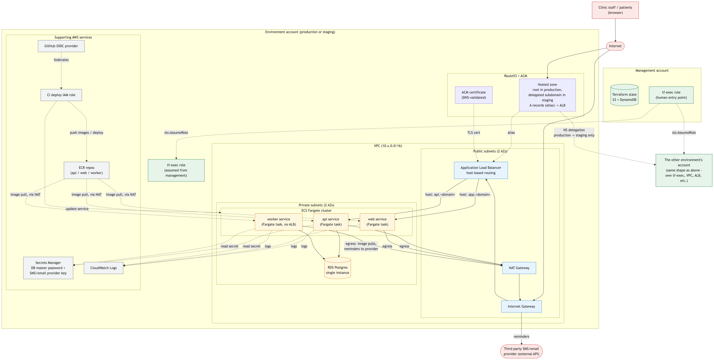

# Architecture Overview

## Diagram
I've included the text version of the diagram at the bottom of this document for reference, as the arrows are a little bit wild to follow in the generated image.



## Reasoning

Before getting into the reasoning behind architectural decisions, here are some of the assumptions made that impacted architectural decisions:

* the web app is a containerized service rather than static files
* no file/object storage; only Postgres used for storage
* one GitHub repo covers all 3 services
* the SMS/email provider's API key is already present in Secrets Manager
* the domain registrar for the root domain can be pointed at Route53 name servers we control (the root zone itself is Terraform-managed, created in the production account)
* the GitHub OIDC identity provider is created once per account by that account's `bootstrap/` config, not assumed to pre-exist

#### Multiple AWS Accounts

In my experience, it is always better to separate environments into their own AWS accounts (or, at the very least, separate nonprod and prod). You greatly reduce the likelihood of something silly happening to prod that was only meant to happen in dev, it increases comfort of iterating against the dev infrastructure, and overall reduces blast radius size. It's also much easier to decide to merge into 1 AWS account in the future than it is to switch from 1 to many.

While this does introduce some complexity and overhead in overall infrastructure management, e.g. DNS records existing in multiple places, tracking billing across multiple accounts, etc., I believe these problems are much more easily solved than those potentially introduced by limiting ourselves to a single AWS account.

#### Publicly Accessible API

Without the full details of how the API is called from the web app, it seems a fair assumption that the API would be called directly from the browser, i.e. the client JS calls are directly hitting the API. Given the time restrictions on this take-home, this was the simpler option to implement (versus a separate, internal ALB for the API service or slight obfuscation of the public accessbility via more restrictive security group rules).

The obvious trade-off here is that of security. If the application's security/authorization implementation is lacking, then we are potentially exposing the API (and thus the contents of the database) to the public internet. This is the architectural decision I am the least confident in, as I don't have a means of vetting the security structure of the application.

#### No Auto-Scaling

The lack of auto-scaling was a decision made both to be conscious of time consumed by this project *and* to pre-emtpively gather data on what scaling might need to look like for this application. Even if there is data available now on what resources this app uses most heavily, e.g. memory or CPU, those metrics are relevant to its single-host infrastructure and may not apply apples-to-apples to the new cluster-based infrastructure.

The trade-off here is that we may see some reliability issues in the early post-cutover days of implementing this infrastructure. That said, the data we can gather about what our limiting resource is and at what point we're limited is incredibly valuable. We may also be able to gather a sense of the seasonality of our load, which could enable building out proactive warming plans.

#### Cutover

Rather, the lack of a cutover plan. I don't necessarily have reasoning behind this other than.. cutover plans are complicated! They're maybe the most complicated part of any big migration like this one. So this is me calling out that I have not laid out a cutover plan in this repository, and the reason for that is there simply wasn't enough time.

## Deployments

For the time being, deployments can be achieved by building a new image, pushing it into AWS ECR, and then triggering a `terraform apply` while passing in the desired image tag with a var argument. The plan is to eventually establish a GHA workflow that builds and publishes the images to ECR, then applies the Terraform accordingly.

## Reference

#### Mermaid Diagram Text

```
%% Acme Corp infrastructure - one environment account (staging or prod),
%% shown alongside the other two accounts at a high level only -
%% each environment account's internals are identical in shape.
%% Paste into https://mermaid.live to render/export
flowchart TD

    Internet(["Internet"])
    Patients["Clinic staff / patients<br/>(browser)"]

    subgraph MGMT["Management account"]
        TFSTATE[("Terraform state<br/>S3 + DynamoDB")]
        TFEXECM["tf-exec role<br/>(human entry point)"]
    end

    subgraph ENV["Environment account (production or staging)"]
        TFEXECE["tf-exec role<br/>(assumed from management)"]

        subgraph DNS["Route53 + ACM"]
            R53["Hosted zone<br/>root in production,<br/>delegated subdomain in staging<br/>A records (alias) -> ALB"]
            ACM["ACM certificate<br/>(DNS-validated)"]
        end

        subgraph VPC["VPC (10.x.0.0/16)"]
            subgraph Public["Public subnets (2 AZs)"]
                IGW["Internet Gateway"]
                ALB["Application Load Balancer<br/>host-based routing"]
                NAT["NAT Gateway"]
            end

            subgraph Private["Private subnets (2 AZs)"]
                subgraph ECS["ECS Fargate cluster"]
                    API["api service<br/>(Fargate task)"]
                    WEB["web service<br/>(Fargate task)"]
                    WORKER["worker service<br/>(Fargate task, no ALB)"]
                end
                RDS[("RDS Postgres<br/>single instance")]
            end
        end

        subgraph Support["Supporting AWS services"]
            ECR["ECR repos<br/>(api / web / worker)"]
            SECRETS["Secrets Manager<br/>DB master password +<br/>SMS/email provider key"]
            LOGS["CloudWatch Logs"]
            CI["CI deploy IAM role"]
            OIDC["GitHub OIDC provider"]
        end
    end

    OTHERENV["The other environment's account<br/>(same shape as above -<br/>own tf-exec, VPC, ALB, etc.)"]

    SMSEMAIL(["Third-party SMS/email<br/>provider (external API)"])

    TFEXECM -.->|sts:AssumeRole| TFEXECE
    TFEXECM -.->|sts:AssumeRole| OTHERENV
    R53 -.->|NS delegation<br/>production -> staging only| OTHERENV

    Patients --> Internet
    Internet --> R53
    R53 -.->|alias| ALB
    ACM -.->|TLS cert| ALB
    Internet --> IGW --> ALB

    ALB -->|host: api.&lt;domain&gt;| API
    ALB -->|host: app.&lt;domain&gt;| WEB

    API --> RDS
    WORKER --> RDS

    API -.->|read secret| SECRETS
    WORKER -.->|read secret| SECRETS

    API -.->|logs| LOGS
    WEB -.->|logs| LOGS
    WORKER -.->|logs| LOGS

    ECR -.->|image pull, via NAT| API
    ECR -.->|image pull, via NAT| WEB
    ECR -.->|image pull, via NAT| WORKER

    API -->|egress| NAT
    WEB -->|egress| NAT
    WORKER -->|egress: image pulls,<br/>reminders to provider| NAT
    NAT --> IGW
    IGW -->|reminders| SMSEMAIL

    CI -.->|push images / deploy| ECR
    CI -.->|update service| ECS
    OIDC -.->|federates| CI

    classDef public fill:#e8f4fd,stroke:#1a73e8
    classDef private fill:#fef7e0,stroke:#e37400
    classDef support fill:#f1f3f4,stroke:#5f6368
    classDef external fill:#fce8e6,stroke:#c5221f
    classDef account fill:#e6f4ea,stroke:#137333

    class IGW,ALB,NAT public
    class API,WEB,WORKER,RDS private
    class ECR,SECRETS,LOGS,CI,OIDC support
    class SMSEMAIL,Internet,Patients external
    class TFSTATE,TFEXECM,TFEXECE,OTHERENV account
```